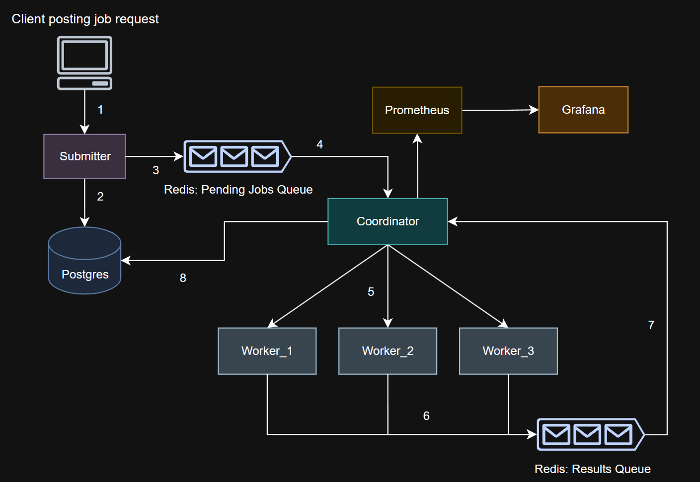

# Distributed Job Scheduler

A robust, scalable distributed job scheduling system built with Go, Python, Redis, PostgreSQL, and monitored with Prometheus & Grafana.


*System Architecture Diagram*

## Features

### Core Functionality
- **Distributed Job Processing**: Horizontal scaling with multiple worker nodes
- **Job Leasing**: Prevents duplicate processing with timeout-based leasing
- **Dead Letter Queue (DQL)**: Handles permanently failed jobs after max retries
- **Exponential Backoff**: Retry mechanism with exponentially increasing delay + jitter to prevent thundering herd
- **Load Balancing**: Least Recently Used (LRU) worker selection algorithm

### Reliability & Resilience
- **Worker Health Monitoring**: Automatic heartbeat verification and state management
- **Lease Timeout Recovery**: Automatic job recovery when worker becomes unavailable
- **Graceful Failure Handling**: Comprehensive error handling and job retry logic
- **Atomic Operations**: Database transactions ensure data consistency

### Observability
- **Prometheus Metrics**: Comprehensive system metrics collection
- **Grafana Dashboard**: Real-time visualization of system performance and health

## Architecture

### Components

1. **Coordinator (Go)**: Central orchestrator managing job distribution and worker coordination
2. **Worker (Python)**: Asynchronous job processors with realistic workload simulations
3. **Submitter (Go)**: REST API for job submission
4. **Redis**: Message queue for job distribution, result collection and dead letter queue
5. **PostgreSQL**: Persistent storage for jobs and workers
6. **Prometheus**: Metrics collection server
7. **Grafana**: Visualization and monitoring dashboard

## Quick Start

### Prerequisites
- Docker & Docker Compose
- Go 1.21+ (for local development)
- Python 3.9+ (for local development)

### 1. Clone Repository
```bash
git clone https://github.com/soum-sr/distributed_job_scheduler.git
cd distributed_job_scheduler
```

### 2. Start Services
```bash
make up
```

### 3. Access Services 
- **Submitter API**: http://localhost:8000 
- **Coordinator**: http://localhost:9000 
- **Grafana Dashboard**: http://localhost:3000 (admin/admin) 
- **Prometheus**: http://localhost:9090 
- **PostgreSQL**: localhost:5432
- **Redis**: localhost:6379

### 4. Submitting Jobs

Use the below curl command sample to submit a cpu_intensive job. More test jobs are present under: ```distributed_job_scheduler/scripts```

```bash

curl -X POST http://localhost:8000/submit_job \
  -H "Content-Type: application/json" \
  -d '{"name": "cpu_intensive", "payload": "test task"}'

```
## Monitoring & Observability

### Grafana Dashboard The system includes a pre-configured Grafana dashboard showing: 
- **Job Processing Rates**: Real time job completion/failure rates 
- **Job Total Counts**: Cumulative completed, failed, and timeout jobs 
- **Worker Status**: Active workers by state (available/busy/unavailable) 
- **Queue Metrics**: Jobs in queue and dead letter queue 
- **Processing Duration**: Job execution time percentiles 
- **Retry Patterns**: Retry attempt distributions by failure reason 
- **Lease Timeouts**: Worker unresponsiveness incidents 


## Project Structure
```
.
├── Makefile
├── README.md
├── coordinator
│   ├── Dockerfile
│   ├── go.mod
│   ├── go.sum
│   ├── handlers.go
│   ├── jobs.go
│   ├── main.go
│   ├── metrics.go
│   ├── utils.go
│   └── worker.go
├── deploy
│   ├── docker-compose.yml
│   ├── grafana
│   │   └── provisioning
│   │       ├── dashboards
│   │       │   ├── dashboard.yml
│   │       │   └── dashboard_content.json
│   │       └── datasources
│   │           └── prometheus.yml
│   ├── initdb
│   │   └── 01_schema.sql
│   └── prometheus
│       └── prometheus.yml
├── docs
│   └── architecture-diagram.png
├── go.work
├── go.work.sum
├── scripts
│   ├── high_volume_stress_test.sh
│   ├── send_cpu_intensive_jobs.sh
│   ├── send_failing_jobs.sh
│   ├── send_io_intensive_jobs.sh
│   └── send_network_intensive_jobs.sh
├── submitter
│   ├── Dockerfile
│   ├── go.mod
│   ├── go.sum
│   └── main.go
└── worker
    ├── Dockerfile
    └── main.py

12 directories, 31 files

```
